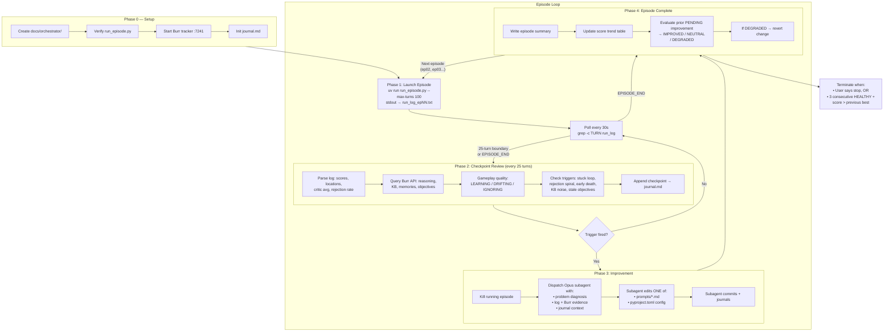
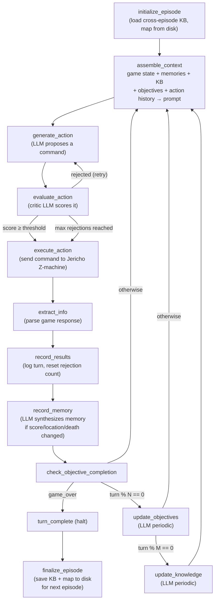
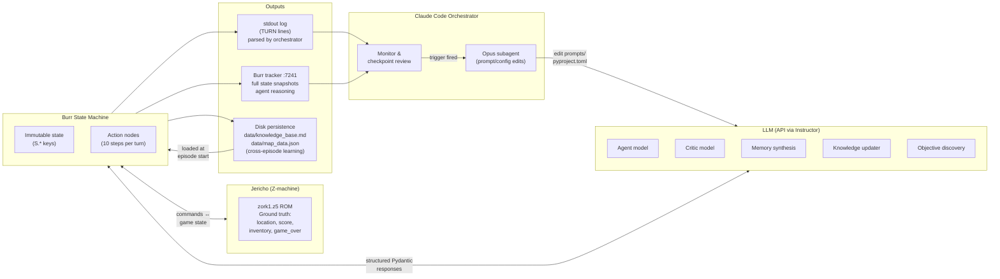
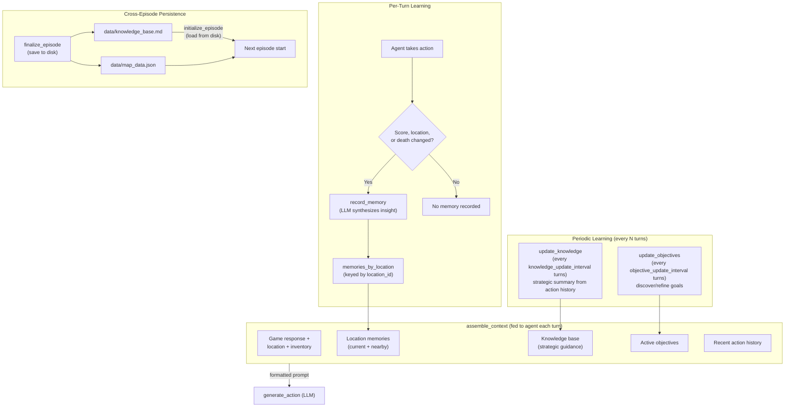

# ZorkBurr System Diagrams

## Orchestrator Loop

```mermaid
flowchart TD
    subgraph Phase0["Phase 0 — Setup"]
        S1[Create docs/orchestrator/]
        S2[Verify run_episode.py]
        S3[Start Burr tracker :7241]
        S4[Init journal.md]
        S1 --> S2 --> S3 --> S4
    end

    Phase0 --> Launch

    subgraph EpisodeLoop["Episode Loop"]
        Launch["Phase 1: Launch Episode<br/>uv run run_episode.py --max-turns 100<br/>stdout → run_log_epNN.txt"]
        Poll["Poll every 30s<br/>grep -c TURN run_log"]

        Launch --> Poll

        subgraph Checkpoint["Phase 2: Checkpoint Review (every 25 turns)"]
            Metrics["Parse log: scores, locations,<br/>critic avg, rejection rate"]
            Burr["Query Burr API: reasoning,<br/>KB, memories, objectives"]
            Quality["Gameplay quality:<br/>LEARNING / DRIFTING / IGNORING"]
            Triggers["Check triggers: stuck loop,<br/>rejection spiral, early death,<br/>KB noise, stale objectives"]
            Journal["Append checkpoint → journal.md"]
            Metrics --> Burr --> Quality --> Triggers --> Journal
        end

        Poll -->|"25-turn boundary<br/>or EPISODE_END"| Checkpoint

        Decision{Trigger fired?}
        Checkpoint --> Decision

        Decision -->|No| Poll

        subgraph Improve["Phase 3: Improvement"]
            Kill[Kill running episode]
            Dispatch["Dispatch Opus subagent with:<br/>• problem diagnosis<br/>• log + Burr evidence<br/>• journal context"]
            Edit["Subagent edits ONE of:<br/>• prompts/*.md<br/>• pyproject.toml config"]
            Commit["Subagent commits + journals"]
            Kill --> Dispatch --> Edit --> Commit
        end

        Decision -->|Yes| Improve

        subgraph Complete["Phase 4: Episode Complete"]
            Summary[Write episode summary]
            Trend[Update score trend table]
            Eval["Evaluate prior PENDING improvement<br/>→ IMPROVED / NEUTRAL / DEGRADED"]
            Revert["If DEGRADED → revert change"]
            Summary --> Trend --> Eval --> Revert
        end

        Poll -->|EPISODE_END| Complete
        Improve --> Complete
        Complete -->|"Next episode<br/>(ep02, ep03...)"| Launch
    end

    Terminate["Terminate when:<br/>• User says stop, OR<br/>• 3 consecutive HEALTHY +<br/>score > previous best"]
    Complete --> Terminate
```

## Burr Turn Graph (Inside Each Episode)

```mermaid
flowchart TD
    Init["initialize_episode<br/>(load cross-episode KB, map from disk)"]
    Init --> AC

    AC["assemble_context<br/>game state + memories + KB<br/>+ objectives + action history → prompt"]

    AC --> GA["generate_action<br/>(LLM proposes a command)"]

    GA --> EA["evaluate_action<br/>(critic LLM scores it)"]

    EA -->|"score ≥ threshold"| EX
    EA -->|"max rejections reached"| EX
    EA -->|"rejected (retry)"| GA

    EX["execute_action<br/>(send command to Jericho Z-machine)"]

    EX --> EI["extract_info<br/>(parse game response)"]
    EI --> RR["record_results<br/>(log turn, reset rejection count)"]
    RR --> RM["record_memory<br/>(LLM synthesizes memory<br/>if score/location/death changed)"]
    RM --> CO["check_objective_completion"]

    CO -->|game_over| TC["turn_complete (halt)"]
    CO -->|"turn % N == 0"| UO["update_objectives<br/>(LLM periodic)"]
    CO -->|otherwise| AC

    UO -->|"turn % M == 0"| UK["update_knowledge<br/>(LLM periodic)"]
    UO -->|otherwise| AC

    UK --> AC

    TC --> FIN["finalize_episode<br/>(save KB + map to disk<br/>for next episode)"]
```

## Data Flow

```mermaid
flowchart LR
    subgraph LLM["LLM (API via Instructor)"]
        Agent[Agent model]
        Critic[Critic model]
        Memory[Memory synthesis]
        KB[Knowledge updater]
        Obj[Objective discovery]
    end

    subgraph BurrGraph["Burr State Machine"]
        States["Immutable state<br/>(S.* keys)"]
        Actions["Action nodes<br/>(10 steps per turn)"]
    end

    subgraph Jericho["Jericho (Z-machine)"]
        Zork["zork1.z5 ROM<br/>Ground truth:<br/>location, score,<br/>inventory, game_over"]
    end

    subgraph Outputs["Outputs"]
        Stdout["stdout log<br/>(TURN lines)<br/>parsed by orchestrator"]
        Tracker["Burr tracker :7241<br/>full state snapshots<br/>agent reasoning"]
        Disk["Disk persistence<br/>data/knowledge_base.md<br/>data/map_data.json<br/>(cross-episode learning)"]
    end

    subgraph Orchestrator["Claude Code Orchestrator"]
        Monitor["Monitor &<br/>checkpoint review"]
        Subagent["Opus subagent<br/>(prompt/config edits)"]
    end

    LLM <-->|"structured Pydantic<br/>responses"| BurrGraph
    BurrGraph <-->|"commands ↔<br/>game state"| Jericho
    BurrGraph --> Stdout
    BurrGraph --> Tracker
    BurrGraph --> Disk
    Stdout --> Monitor
    Tracker --> Monitor
    Monitor -->|"trigger fired"| Subagent
    Subagent -->|"edit prompts/<br/>pyproject.toml"| LLM
    Disk -->|"loaded at<br/>episode start"| BurrGraph
```

## Learning Systems

```mermaid
flowchart TD
    subgraph PerTurn["Per-Turn Learning"]
        Action[Agent takes action] --> ScoreChange{Score, location,<br/>or death changed?}
        ScoreChange -->|Yes| Synthesize["record_memory<br/>(LLM synthesizes insight)"]
        ScoreChange -->|No| Skip[No memory recorded]
        Synthesize --> LocMem["memories_by_location<br/>(keyed by location_id)"]
    end

    subgraph Periodic["Periodic Learning (every N turns)"]
        ObjUpdate["update_objectives<br/>(every objective_update_interval turns)<br/>discover/refine goals"]
        KBUpdate["update_knowledge<br/>(every knowledge_update_interval turns)<br/>strategic summary from action history"]
    end

    subgraph CrossEpisode["Cross-Episode Persistence"]
        KBFile["data/knowledge_base.md"]
        MapFile["data/map_data.json"]
        EpEnd["finalize_episode<br/>(save to disk)"] --> KBFile
        EpEnd --> MapFile
        KBFile -->|"initialize_episode<br/>(load from disk)"| NextEp[Next episode start]
        MapFile --> NextEp
    end

    subgraph Context["assemble_context (fed to agent each turn)"]
        GameState["Game response +<br/>location + inventory"]
        MemView["Location memories<br/>(current + nearby)"]
        KBView["Knowledge base<br/>(strategic guidance)"]
        ObjView["Active objectives"]
        History["Recent action history"]
    end

    LocMem --> MemView
    KBUpdate --> KBView
    ObjUpdate --> ObjView

    Context -->|"formatted prompt"| Agent2["generate_action (LLM)"]
```
